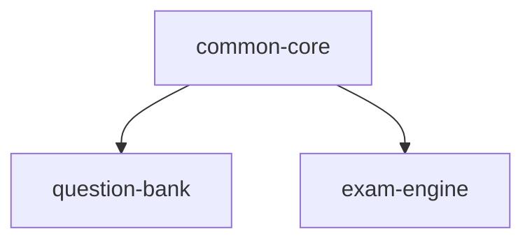

# 总设计方案：<变更名称>

<!-- 只写全局层面的 HOW；单模块内部结构/表设计/API 明细属于 design/<模块>.md -->

## Context（背景）

<!-- 现状、约束、干系人 -->

## Goals / Non-Goals

- 目标：
- 非目标：

## 模块划分与依赖图 + 执行顺序编号

<!-- 以 proposal 的 Capabilities 清单为准；文字或 mermaid 均可。
     对依赖图做拓扑排序得出执行顺序编号：串行递增、并行共用同一编号，
     common-core 恒为 1，integration 恒为最后。
     该编号是全流程唯一来源：design/<模块>.md 头部、tasks.md 阶段号、
     tasks/<模块>.md 头部都直接引用 -->

**执行顺序编号**：`1-2-2-3`（common-core → question-bank ∥ exam-engine → integration）

| 模块 | 顺序编号 | 职责 | 依赖 | 可否并行 |
|------|---------|------|------|----------|
| common-core | 1 | | - | 串行（基础） |
| <模块A> | 2 | | common-core | 与 <模块B> 并行 |
| <模块B> | 2 | | common-core | 与 <模块A> 并行 |
| integration | 3 | | 全部模块 | 串行（收尾） |

## 跨模块接口契约

<!-- 模块之间互相调用的接口定义（路径/方法/入参/出参/错误码）。
     唯一来源：design/<模块>.md 只引用，不得重复定义或私自更改 -->

### <模块A> → <模块B>: <契约名称>

- `POST /api/...`
- 入参：
- 出参：
- 错误码：

## 公共数据模型

<!-- 被多个模块引用的核心实体，字段级定义。
     "说明"列即列备注，必须填写业务含义（枚举取值/单位/取值范围），不得留空；
     若以 DDL 形式给出公共表，必须带表备注和每一列的列备注
     （MySQL 用 COMMENT 子句，PostgreSQL 用 COMMENT ON TABLE/COLUMN 语句） -->

### <实体名>

| 字段 | 类型 | 说明 |
|------|------|------|
| | | <业务含义，必填> |

## 横切规范

<!-- 所有模块必须遵守：统一错误码、鉴权方式、分页约定、命名规范 -->

## Decisions（技术决策）

<!-- 每个关键决策给 2-3 个备选方案和取舍理由；
     新依赖必须说明版本和引入必要性 -->

### 决策 1：<主题>

- 备选 A：
- 备选 B：
- **选择**：<X>，理由：

## Risks / Trade-offs

- [风险描述] → 缓解措施

## Open Questions

- [ ] <待解决的未知项>
